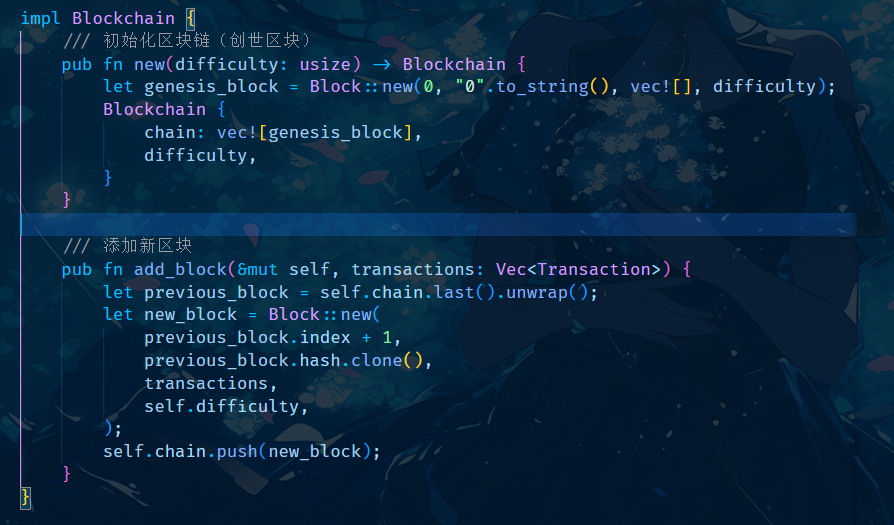

#  Rust 区块链项目说明

##  1. 项目概述
本项目是一个**基于 Rust 语言的轻量级区块链系统**，采用 **PoW（工作量证明）** 机制进行挖矿，支持交易管理、区块存储、数据持久化，并提供 CLI 交互功能。

### **🔹 项目特点**
- 轻量级 Rust 实现，适合学习和研究
- 支持 PoW 挖矿机制，确保区块链安全
- 交易系统存储在区块链中
- CLI 交互方式，提供便捷的管理操作
- 数据持久化存储到 JSON，支持加载与保存

---

##  2. 主要功能
| 功能 | 描述 |
|------|------|
|  CLI 交互 | 通过命令行操作区块链 |
|  挖矿机制 | PoW 计算 `nonce` 直至满足难度 |
|  交易系统 | 存储 & 验证交易数据 |
|  数据持久化 | 以 JSON 方式存储区块数据 |
|  区块完整性检查 | 确保数据一致性和安全性 |

---

##  3. 目录结构

| 文件/目录          | 说明                 |
|------------------|--------------------|
| `simple_blockchain/` | 项目根目录           |
| ├── `src/`        | 源代码目录           |
| │ ├── `main.rs`   | 入口文件，启动程序      |
| │ ├── `block.rs`  | 定义区块结构          |
| │ ├── `blockchain.rs` | 处理区块链逻辑       |
| │ ├── `transaction.rs` | 交易结构与处理      |
| │ ├── `pow.rs`    | PoW 工作量证明挖矿  |
| │ ├── `cli.rs`    | 命令行交互（CLI）     |
| │ ├── `storage.rs` | 数据存储（文件/数据库）|
| ├── `Cargo.toml`  | Rust 依赖管理文件    |

##  4. 核心技术
- **语言**：Rust
- **共识机制**：PoW（Proof of Work）
- **哈希算法**：SHA-256
- **存储方式**：JSON 文件持久化
- **交互方式**：命令行（CLI）

##  5. 部分代码实现
### **Block 实现**

### **BlockChain 实现**

### **Storage 实现**

##  6. 项目截图
下面是项目的运行截图示例
### **CLI 交互**

### **检查区块链** (check)

### **挖矿过程** (mining)

### **区块数据** (view)

### **退出程序** (exit)
